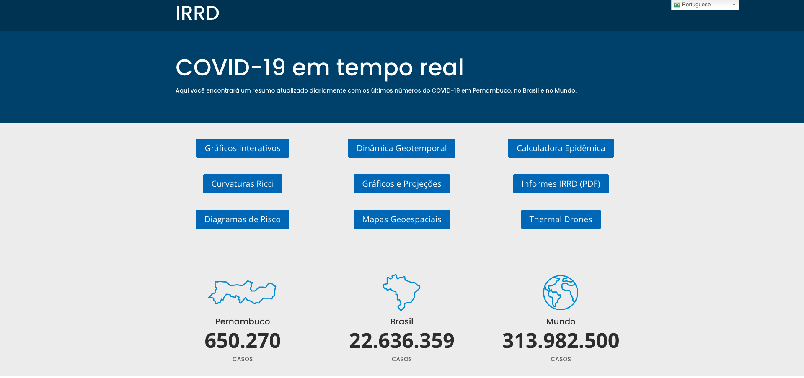

# Covid-19 Pernambuco

Desde o início da pandemia de COVID-19 acompanhamos os números de casos, óbitos e vacinação no estado de Pernambuco (Nordeste do Brasil), Brasil e Mundo. 

Especificamente para o estado de Pernambuco, os dados são recebidos a partir da Secretaria de Saúde, processados e atualizados diariamente.

Neste repositório, você encontra as seguintes bases de dados:

- `geres_media_movel`
- `macros_media_movel`
- `novos_casos_PE`
- `novos_obitos_PE`
- `total_cases_PE`
- `total_deaths_PE`
- `variacao_casos_PE`
- `variacao_obitos_PE`
- `variacao_casos_geres`
- `variacao_casos_macros`

Mais informações, gráficos e dashboards sobre a pandemia podem ser encontrados no site do IRRD-PE: https://www.irrd.org/covid-19/ 
